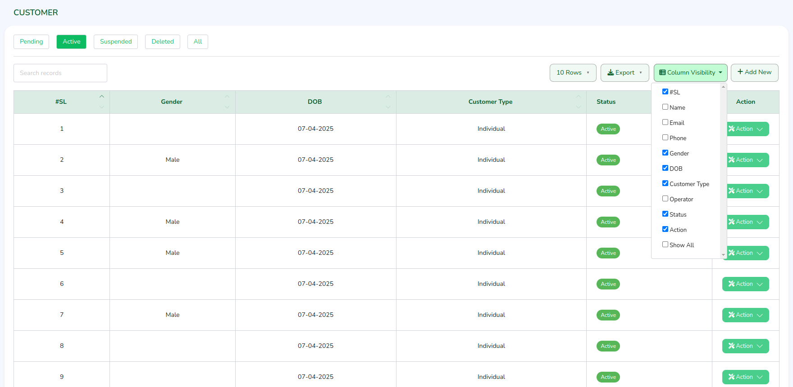

# Laravel Column Visibility

[](https://packagist.org/packages/mohasin-dev/column-visibility)
[](https://github.com/mohasin-dev/column-visibility/stargazers)
[](https://packagist.org/packages/mohasin-dev/column-visibility)
[](LICENSE)

A Laravel package for managing and persisting DataTables column visibility preferences per user across sessions and devices.

---



---

## 🚀 Features

- **User-Specific Column Visibility**: Saves each user's column visibility preferences.
- **Automatic Restoration**: Automatically restores column settings upon each visit to the table.
- **Blade Component**: Dynamically inject column visibility preferences via a Blade component.
- **Global Usage**: Works across any table in your Laravel project.
- **Easy Integration**: Simple to install, configure, and customize.
- **Compatibility**: Built for Laravel 9, 10, and 11.

---

## 📦 Installation

1. **Install the package via Composer**:

   ```bash
   composer require mohasin-dev/column-visibility

2. **Then publish assets and migrate the database**:
    
    ```bash
    php artisan vendor:publish --tag=public
    php artisan vendor:publish --tag=views
    php artisan migrate

### 🧩 Usage

Step 1: Include Blade Component in View

    <x-column-visibility::column-visibility table-key="users" table-id="dataTable" /> 
    // table-key: Unique string to identify your table (e.g. users, orders)
    // table-id: ID of your HTML table (<table id="dataTable">)
  
Step 2: Use JS Helper in Your DataTable Init

    let table = $('#dataTable').DataTable({
      columnDefs: buildColumnDefs([0, 4, 5, 6, 9]), // param is optional: text-center targets
      ...
    });

### 🧠 How It Works

- Saves column preferences (hidden columns) in a column_preferences table.
- Automatically injects hidden columns for the user via a Blade component.
- The JS helper buildColumnDefs() builds the correct columnDefs dynamically.

### 🛠️ Requirements

    PHP 8.0+
    Laravel 9, 10, or 11
    jQuery DataTables

### 🤝 Contributing

Pull requests are welcome. For major changes, please open an issue first to discuss what you'd like to change.

### 📝 License

This package is open-source software licensed under the MIT license.

### 🙌 Author

Mohasin Hossain

Portfolio → https://mohasin.dev

LinkedIn → https://www.linkedin.com/in/mohasin-dev

GitHub → https://github.com/mohasin-dev
